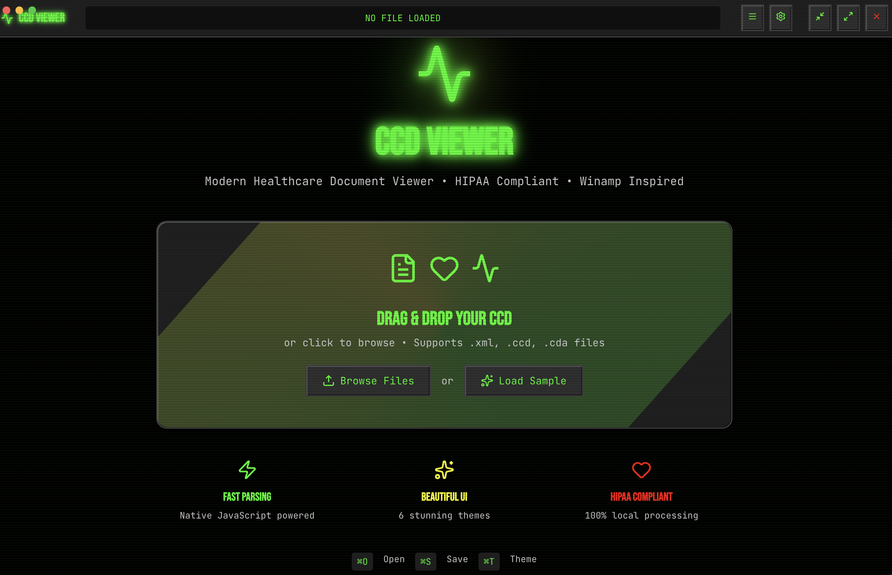
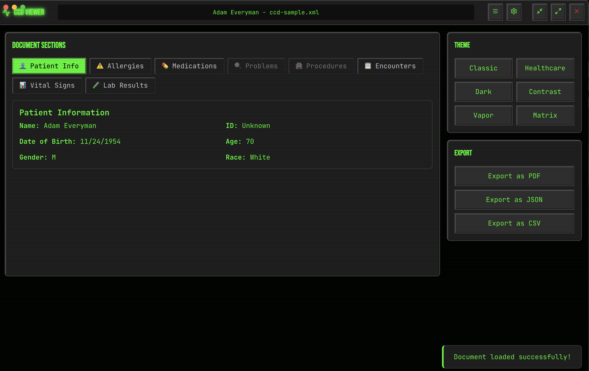
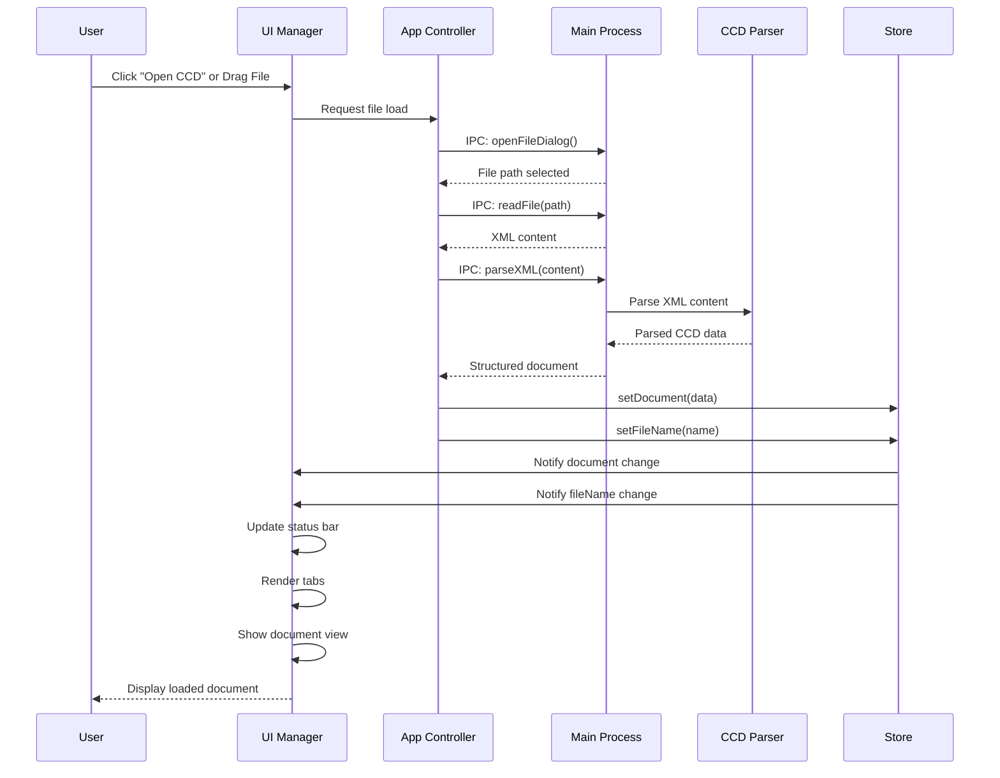
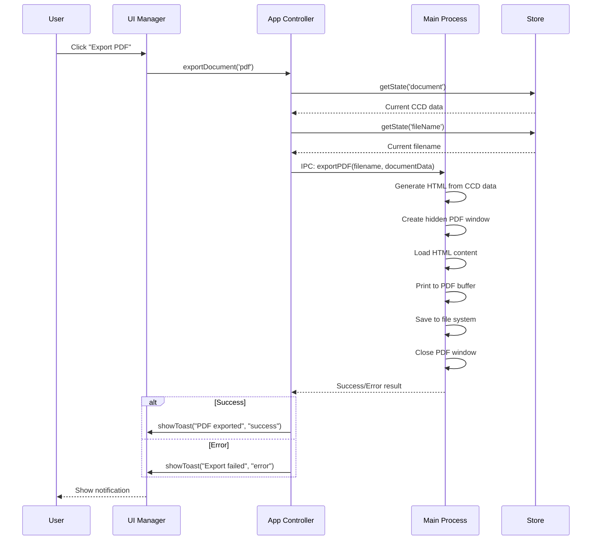
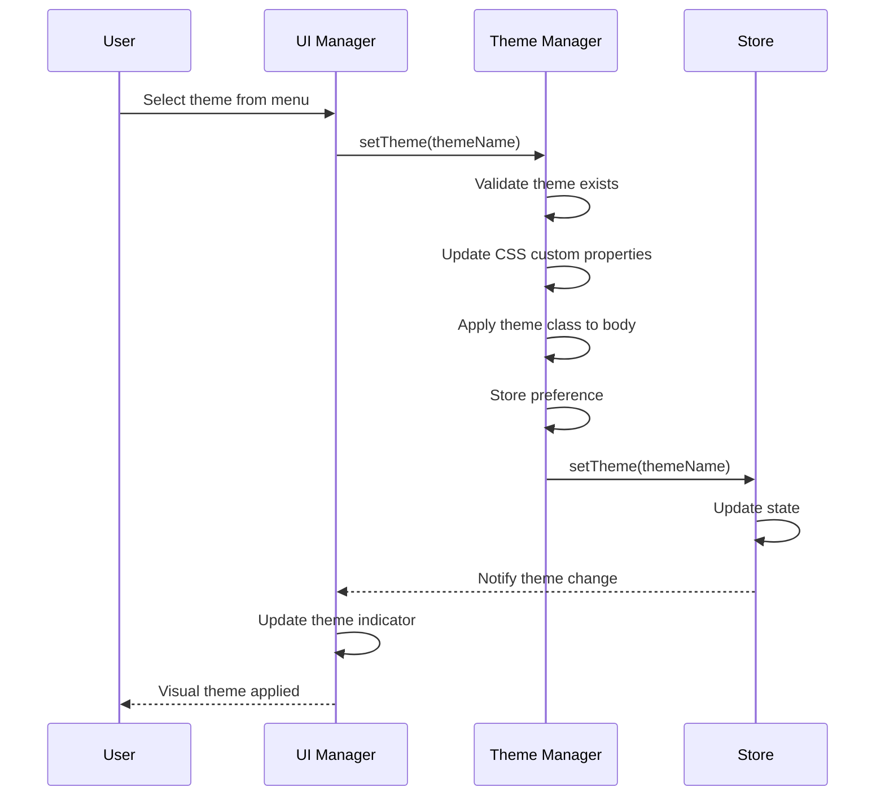
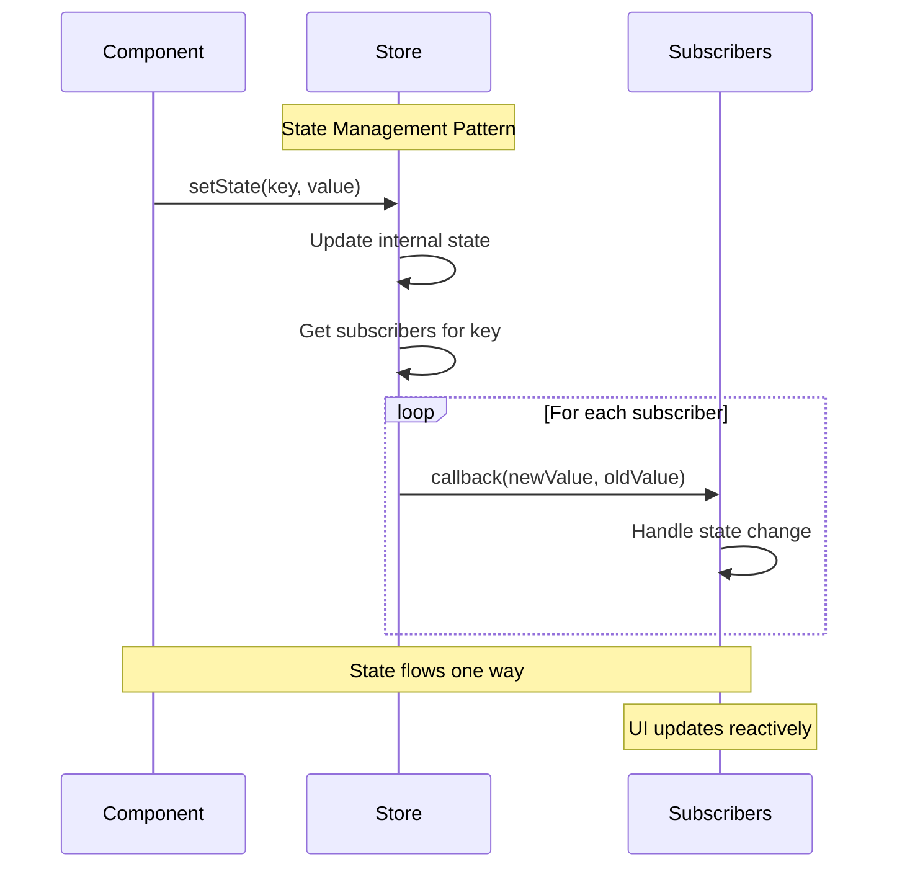

# CCD Offline Viewer - Pure Electron SPA

A modern, HIPAA-compliant Continuity of Care Document viewer built with pure Electron and vanilla JavaScript.

## Screenshots

### Main Interface

*Clean, Winamp-inspired interface with drag & drop file loading and theme switching*

### Document Viewer

*Comprehensive document viewer showing patient information, allergies, medications, and more*

## Features

🏥 **Complete CCD/CDA Support** - Parse and view medical documents
🎨 **6 Stunning Themes** - Classic Winamp, Healthcare, Dark, Contrast, Vaporwave, Matrix  
🖱️ **Drag & Drop Interface** - Beautiful file loading experience
📊 **Rich Document Viewer** - Patient info, allergies, medications, problems, procedures, encounters, vitals, labs
📤 **Export Functionality** - JSON and CSV export with native file dialogs
🎯 **100% Local Processing** - HIPAA-compliant, no network requests
⚡ **Fast & Lightweight** - Pure vanilla JavaScript, no frameworks
🎮 **Winamp-Inspired UI** - Nostalgic design with modern functionality
⌨️ **Keyboard Shortcuts** - ⌘O (Open), ⌘S (Save), ⌘T (Theme)

## Architecture

### System Overview

```
┌─────────────────────────────────────────────────────────────┐
│                     CCD VIEWER ARCHITECTURE                 │
├─────────────────────────────────────────────────────────────┤
│                                                             │
│  ┌─────────────────────┐    IPC     ┌──────────────────────┐ │
│  │   MAIN PROCESS      │◄──────────►│   RENDERER PROCESS   │ │
│  │                     │            │                      │ │
│  │  ┌───────────────┐  │            │  ┌─────────────────┐ │ │
│  │  │   main.js     │  │            │  │   index.html    │ │ │
│  │  │               │  │            │  │                 │ │ │
│  │  │ • File I/O    │  │            │  │ ┌─────────────┐ │ │ │
│  │  │ • PDF Export  │  │            │  │ │   app.js    │ │ │ │
│  │  │ • XML Parsing │  │            │  │ │ (Main Ctrl) │ │ │ │
│  │  │ • Menu System │  │            │  │ └─────────────┘ │ │ │
│  │  │ • Dialogs     │  │            │  │                 │ │ │
│  │  └───────────────┘  │            │  │ ┌─────────────┐ │ │ │
│  │                     │            │  │ │  store.js   │ │ │ │
│  │  ┌───────────────┐  │            │  │ │   (State)   │ │ │ │
│  │  │  preload.js   │  │            │  │ └─────────────┘ │ │ │
│  │  │               │  │            │  │                 │ │ │
│  │  │ • IPC Bridge  │  │            │  │ ┌─────────────┐ │ │ │
│  │  │ • Security    │  │            │  │ │   ui.js     │ │ │ │
│  │  │ • API Expose  │  │            │  │ │ (UI Logic)  │ │ │ │
│  │  └───────────────┘  │            │  │ └─────────────┘ │ │ │
│  └─────────────────────┘            │  │                 │ │ │
│                                     │  │ ┌─────────────┐ │ │ │
│                                     │  │ │ themes.js   │ │ │ │
│                                     │  │ │ (Theming)   │ │ │ │
│                                     │  │ └─────────────┘ │ │ │
│                                     │  │                 │ │ │
│                                     │  │ ┌─────────────┐ │ │ │
│                                     │  │ │ccd-parser.js│ │ │ │
│                                     │  │ │ (CCD Logic) │ │ │ │
│                                     │  │ └─────────────┘ │ │ │
│                                     │  └─────────────────┘ │ │
│                                     └──────────────────────┘ │
├─────────────────────────────────────────────────────────────┤
│                        DATA FLOW                            │
│                                                             │
│  CCD File → Main Process → XML Parser → Renderer →         │
│  State Store → UI Components → User Display                 │
│                                                             │
└─────────────────────────────────────────────────────────────┘
```

### Component Architecture

```
┌──────────────────────────────────────────────────────────────┐
│                    RENDERER PROCESS LAYERS                   │
├──────────────────────────────────────────────────────────────┤
│                                                              │
│ ┌──────────────────────────────────────────────────────────┐ │
│ │                    UI LAYER                              │ │
│ │                                                          │ │
│ │  ┌─────────────┐  ┌─────────────┐  ┌─────────────────┐  │ │
│ │  │   Header    │  │    Tabs     │  │   Export Menu   │  │ │
│ │  │             │  │             │  │                 │  │ │
│ │  │ • Status    │  │ • Patient   │  │ • PDF Export    │  │ │
│ │  │ • Controls  │  │ • Allergies │  │ • JSON Export   │  │ │
│ │  │ • Themes    │  │ • Meds      │  │ • CSV Export    │  │ │
│ │  └─────────────┘  │ • Problems  │  └─────────────────┘  │ │
│ │                   │ • Vitals    │                       │ │
│ │                   │ • Labs      │                       │ │
│ │                   └─────────────┘                       │ │
│ └──────────────────────────────────────────────────────────┘ │
│                                │                             │
│ ┌──────────────────────────────▼─────────────────────────────┐ │
│ │                  CONTROLLER LAYER                        │ │
│ │                                                          │ │
│ │  ┌─────────────────────────────────────────────────────┐ │ │
│ │  │                   app.js                           │ │ │
│ │  │                                                    │ │ │
│ │  │ • File Operations    • Export Management          │ │ │
│ │  │ • Electron Integration • Error Handling           │ │ │
│ │  │ • Event Coordination   • Lifecycle Management     │ │ │
│ │  └─────────────────────────────────────────────────────┘ │ │
│ └──────────────────────────────────────────────────────────┘ │
│                                │                             │
│ ┌──────────────────────────────▼─────────────────────────────┐ │
│ │                   STATE LAYER                            │ │
│ │                                                          │ │
│ │  ┌─────────────┐  ┌─────────────┐  ┌─────────────────┐  │ │
│ │  │  store.js   │  │  themes.js  │  │  ccd-parser.js  │  │ │
│ │  │             │  │             │  │                 │  │ │
│ │  │ • Document  │  │ • Theme     │  │ • XML Parsing   │  │ │
│ │  │ • Loading   │  │   Switching │  │ • Data Extract  │  │ │
│ │  │ • Error     │  │ • CSS Vars  │  │ • Validation    │  │ │
│ │  │ • fileName  │  │ • Animation │  │ • Structuring   │  │ │
│ │  │ • Tabs      │  │             │  │                 │  │ │
│ │  └─────────────┘  └─────────────┘  └─────────────────┘  │ │
│ └──────────────────────────────────────────────────────────┘ │
│                                                              │
└──────────────────────────────────────────────────────────────┘
```

### Sequence Diagrams

#### File Loading Sequence



#### PDF Export Sequence



#### Theme Switching Sequence



#### State Management Flow



- **Pure Electron** - No React, Next.js, or other framework overhead
- **Vanilla JavaScript** - Clean, maintainable code
- **Single HTML File** - Simple renderer with modular JS components
- **Native Integration** - File dialogs, menu system, IPC communication
- **Secure IPC** - Context isolation with controlled API surface
- **Reactive State** - Publisher/subscriber pattern for UI updates

## Development

```bash
# Install dependencies
npm install

# Run in development
npm start

# Build distributables
npm run dist
```

## Structure

```
├── main.js              # Electron main process
├── preload.js           # IPC bridge
├── renderer/
│   ├── index.html       # Single-page application
│   ├── css/            
│   │   ├── styles.css   # Core styles & utilities
│   │   ├── themes.css   # Theme definitions
│   │   └── animations.css # Delightful animations
│   └── js/
│       ├── ccd-parser.js  # CCD/CDA parsing
│       ├── store.js       # State management
│       ├── themes.js      # Theme system
│       ├── ui.js          # UI components
│       └── app.js         # Main controller
└── dist/                # Built distributables
```

## Themes

- **Classic Winamp** - Green terminal with scanlines
- **Healthcare Blue** - Professional medical interface
- **Dark Mode** - Purple accents with glow effects
- **High Contrast** - Maximum accessibility
- **Vaporwave** - Pink/cyan 80s aesthetics
- **Matrix** - Digital rain effects

## Distribution

### Automated Releases

This project uses GitHub Actions for automated building and releasing:

- **🏷️ Tagged Releases**: Push a git tag (e.g., `v1.0.1`) to trigger automatic builds for all platforms
- **🚀 Manual Releases**: Use the "Manual Release" workflow in GitHub Actions for on-demand builds
- **🧪 CI Testing**: All pushes and PRs are automatically tested on macOS, Windows, and Linux

### Download Options

#### From GitHub Releases (Recommended)
- **macOS (Intel)**: `CCD-Viewer-v*.*.--mac-intel.dmg`
- **macOS (Apple Silicon)**: `CCD-Viewer-v*.*.*-mac-arm64.dmg` 
- **Windows (x64)**: `CCD-Viewer-v*.*.*-windows-x64.exe`

#### Build Locally
```bash
# Clone the repository
git clone https://github.com/tsmada/ccd-offline-viewer.git
cd ccd-offline-viewer

# Install dependencies
npm install

# Build for your platform
npm run dist:mac      # macOS Intel
npm run dist:mac:arm64 # macOS Apple Silicon  
npm run dist:win      # Windows x64
npm run dist:linux    # Linux x64
```

### Release Process

To create a new release:

1. **Tag-based release**:
   ```bash
   git tag v1.0.1
   git push origin v1.0.1
   ```

2. **Manual release**:
   - Go to GitHub Actions → "Manual Release" 
   - Click "Run workflow"
   - Enter version (e.g., `v1.0.1`)
   - Select pre-release if needed

### GitHub Actions Workflows

- **`.github/workflows/ci.yml`**: Tests builds on every push/PR
- **`.github/workflows/build-and-release.yml`**: Builds releases on git tags
- **`.github/workflows/manual-release.yml`**: Manual release workflow with custom version

---

Built with ❤️ using pure Electron, vanilla JavaScript, and automated CI/CD